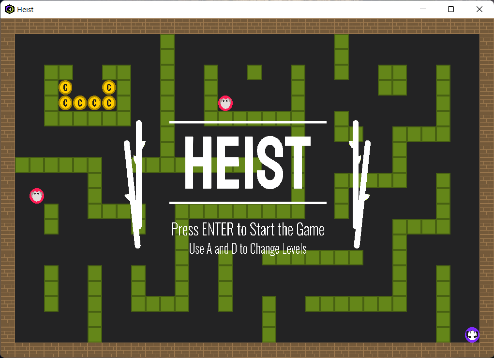
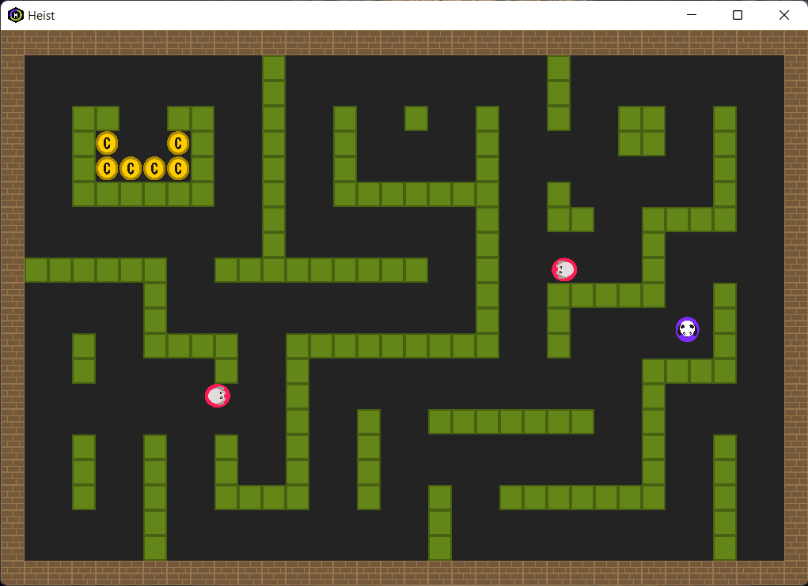
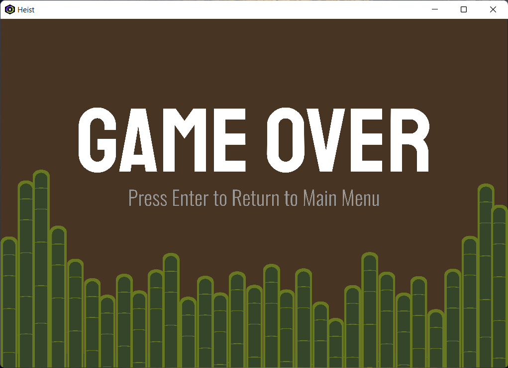

<h3 align="center">
     
</h3>

     
     

Heist is a 2D game created using OpenGL and C++. Inspired by the classic Pac-Man arcade game, you play as the purple Panda, who must navigate the bamboo forest to find and capture the coins located throughout the map. However, with the red enemies tracking you down, getting to the coins won't be so easy!

### Game Demo

&nbsp;

     
     
     

&nbsp;

### Features
* Implemented grid based **spatial partitioning** algorithm to limit amount of data being rendered at once
* Implemented **A\* path finding algorithm** to allow enemies to locate and move to player
* **Level selection & creation** (Add your own custom .hlvl file to the levels folder)
* AABB **collision detection** for circles and rectangles

### Screenshots

     
     
     

### Libraries Used
Heist makes use of GLFW, GLAD, GLM and STBI libraries. 